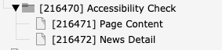
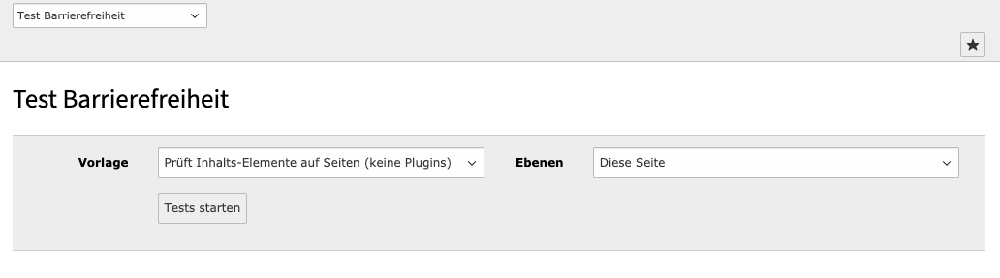
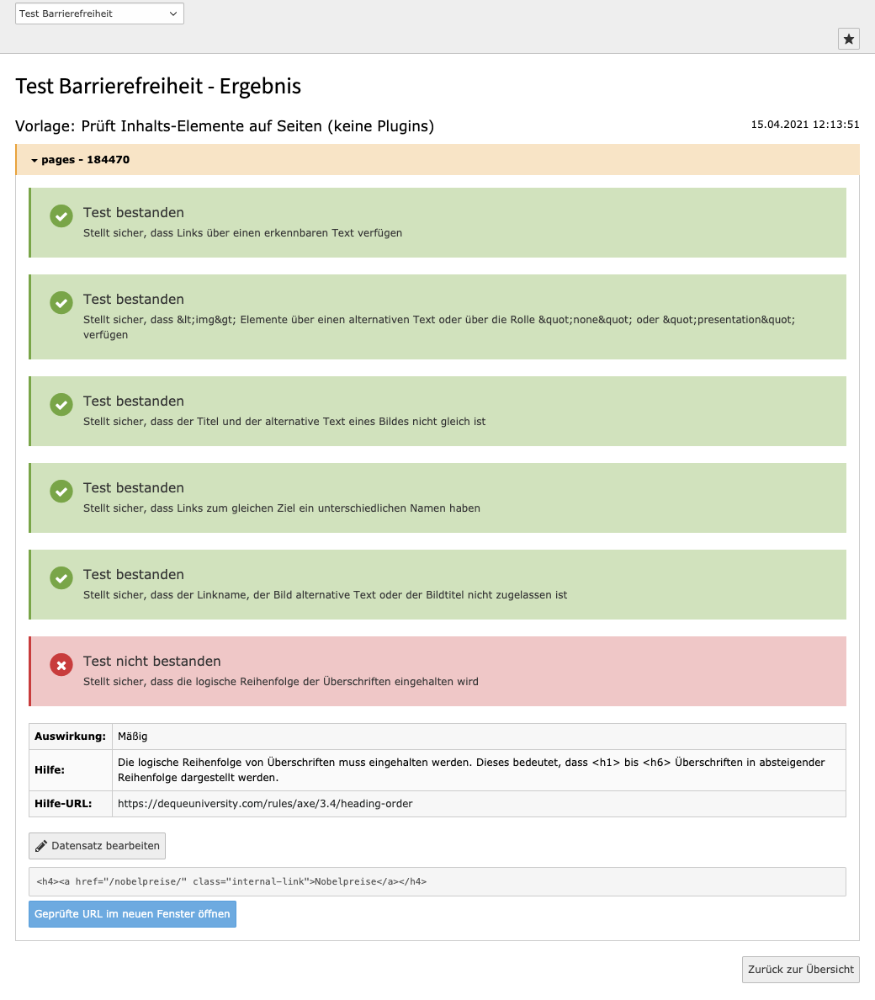
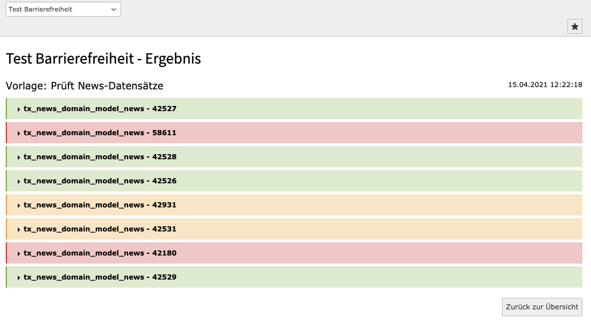
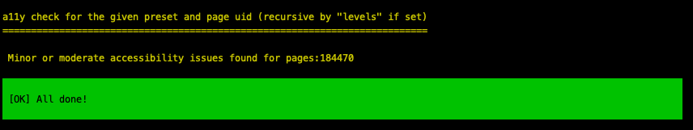
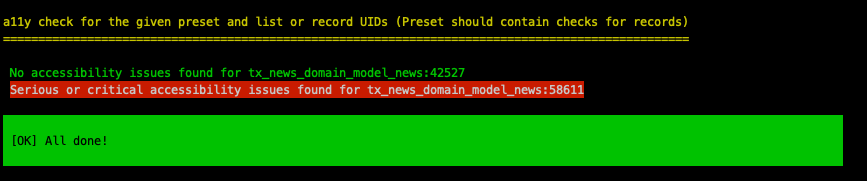
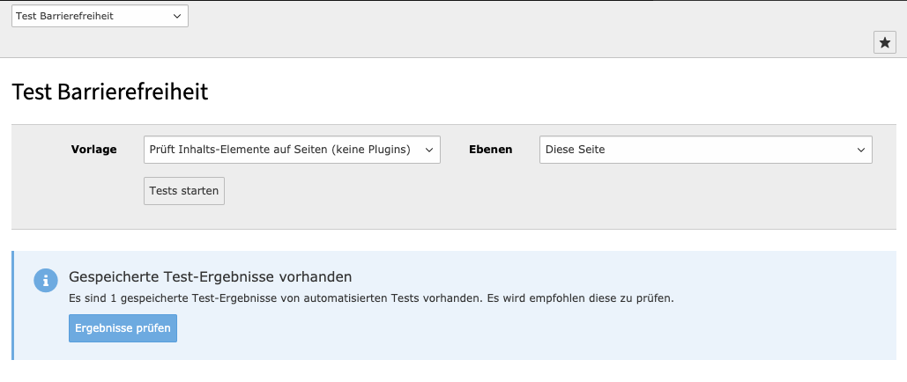

# TYPO3 a11y check

This TYPO3 extension has been developed for the [Julius-Maximilians-Universität Würzburg](https://www.uni-wuerzburg.de).

## What is it?
The TYPO3 extension "uw_a11y_check" aims to provide the functionality to evaluate **editor generated content**
against a configurable set of accessibility checks.  

## How it works?
It is assumed, that the main template of the TYPO3 website is A11Y compliant, which is usually done by the 
TYPO3 integrator. So basically, the template generated frontend output of a page (e.g. header, 
footer, menus, ...) can be excluded from A11Y checks when only editor generated content has to be processed.

In order to only check the editor generated content the extension comes with a custom plugin, which renders
all content elements of a given page. This frontend output of those content elements is then checked against
a configuable set of accessibility checks.

Editor generated content in record (e.g. ext:news record) can also be checked by providing a custom page
where the plugin of the affected extension is in place to render a view (e.g. detail view).

The extension is highly configurable and comes with a limited set of A11Y checks, which are processed
by analyzing generated HTML content. It is however possible to implement custom checks (e.g. processed
by a 3rd party A11Y checker)

**Note:** The included internal tests using symfony domcrawler do only analyze the structure of the DOM and
do not respect any post-modifications to generated HTML e.g. by JavaScript. If you require more precise A11Y
checks (e.g. through a 3rd party A11Y check), this can be archieved using a custom analyzer (see section 
"Customization")

## Installation

The extension can be used in composer and non-composer environments. For non-composer environments, the extension
automatically includes required dependencies (mainly several symfony packages).

After installing the extension, the static TypoScript "TYPO3 Accessibility Check" must be included in your
TypoScript template.

Once installed and configured, the following components are available:

* "Accessibility Check" backend module
* Symfony command `uw_a11y_check:check:presetByPageUid` to check a TYPO3 page/sysfolder with a given preset
* Symfony command `uw_a11y_check:check:presetByRecordUids` to check a list of record with a given preset

## Configuration

### Requirements:

* An extension (e.g. sitepackage), where you can add the configuration of the A11Y Check extension
* A "blank" backend layout, which is configured to only output content of one column and not include headers, 
  footer, menus, ...

### Setup with default configuration

The extension is configured with YAML files. It includes a default configuration, that **must** be overwritten
with a custom configuration. The default configuration includes 2 check presets, which will use the provided
default testsuites with internal A11Y checks.

In order to overwrite the default configuration, add the following code snippet  to the `ext_localconf.php` of 
an existing extension (e.g. website site package).

1. Overwrite default configuration

It is possible to overwrite the default configuration by eigher a custom YAML configuration file or by
using TYPO3 site settings, which are available since TYPO3 10.4

1.1 Overwrite configuration by custom YAML configuration file

This is recommended, if you want to overwrite or create a completely new configuration for the extension.

```
$GLOBALS['TYPO3_CONF_VARS']['UwA11yCheck']['Configuration'] = 'EXT:your_sitepackage/Configuration/A11y/Default.yaml';
```

1.2 Overwrite configuration by TYPO3 site settings

If you just want to override single configuration values from the default configuration, it is possible to use TYPO3
site configuration as shown below:

```
settings:
  uw_a11y_check:
    presets:
      pageContent:
        checkUrlGenerator:
          configuration:
            targetPid: 71
      extNews:
        checkUrlGenerator:
          configuration:
            targetPid: 73
```


Next you should copy the contents of the default configuration to your configuration file.

2. Create pages with plugins for page content and ext:news (if installed)

Create 2 pages in the TYPO3 pagetree in a new sysfolder and assign the "blank" backend layout to each page.
- On the page for the page content, add the plugin "Display content elements for a11y check"
- On the page for ext:news records, add and configure the ext:news plugin and ensure to set the displaymode 
  to "Detailview" 

Example screenshot of the page structure.



3. Add the page uids to configuration

In your configuration (eiter YAML file or TYPO3 site settings), you must add the page UIDs in the `checkUrlGenerator` 
configuration for each preset.

Example (shortened):

```
presets:
  pageContent:
    checkUrlGenerator:
      configuration:
        targetPid: 216471
```

The A11Y check for the preset `pageContent` will now use PID 216471 to render all content elements of the page
to check. Basically, the PID is only important for the extension to generate the check-URL where rendered
content is fetched.

## Backend module 

Once the extension is configured, the backend module can be used to execute configured check presets.



Example output of check result for a preset that checks page content elements:



Example output of check result for a preset that checks ext:news records:



## Commands

The extension comes with 2 symfony console commands to process A11Y analysis in CLI context. Checkresults
will be saved to the database.

### Command: presetByPageUid

The command `uw_a11y_check:check:presetByPageUid` will check a TYPO3 page / sysfolder (recursive if configured)
with a given preset.

Example command: `./typo3/sysext/core/bin/typo3 uw_a11y_check:check:presetByPageUid pageContent 184470`

Example output:



### Command: presetByRecordUids

The command `uw_a11y_check:check:presetByPageUid` will check a list of record with a given preset

Example command: `./typo3/sysext/core/bin/typo3 uw_a11y_check:check:presetByRecordUids extNews 42527,58611`

Example output:




### View results checks processed by commands

It is possible to view saved check results using the extension backend module. If a saved resultset exists,
a notice is shown (see example screenshot below):



## Customization

It is possible to customize the analysis logic of the extension. If e.g. the output of an Extbase extension 
need to be analyzed, you can add a custom analyzer together with a custom CheckUrlGenerator and implement
analysis logic.

If the default internal tests do not fulfill your requirements or if you want to use an external A11Y check,
you can implement a testsuite with custom tests. 

The included analyzers, checkUrlGenerators and testSuites should give a detailled overview of, how the analyze 
logic is created and how it can be customized.

### Analyzers

Analyzers provide the execution logic for A11Y checks. The extension comes with 2 analyzers (`PageContentAnalyzer` and
`NewsAnalyzer`) which are used in configuration presets. The analyzer will fetch the page content for the A11Y check,
process all configured testsuites of a preset and will return the result of the check.

### CheckUrlGenerators

A CheckUrlGenerator is used to create links to internal pages, where plugins (see Configuration step 2) have been
added.

### Testsuites

Testsuites are usually a group of single A11Y checks, which are executed by the configured analyzer. The extension
comes with a testsuite of internal tests, which do A11Y analysis of rendered HTML content using symfony crawler. 

### Presets

Presets (configured in the YAML configuration) define a logical set of one analyzer, one checkUrlGenerator and the
configuration for all included testsuites. Note, that all testsuites will be executed for each preset.

## Versions

| Version | TYPO3 | PHP       | Support/Development                  |
|---------|-------|-----------|--------------------------------------|
| 4.x     | 11.5  | 7.4 - 8.2 | Features, Bugfixes, Security Updates |
| 3.x     | 10.4  | 7.2 - 7.4 | Bugfixes, Security Updates           |
